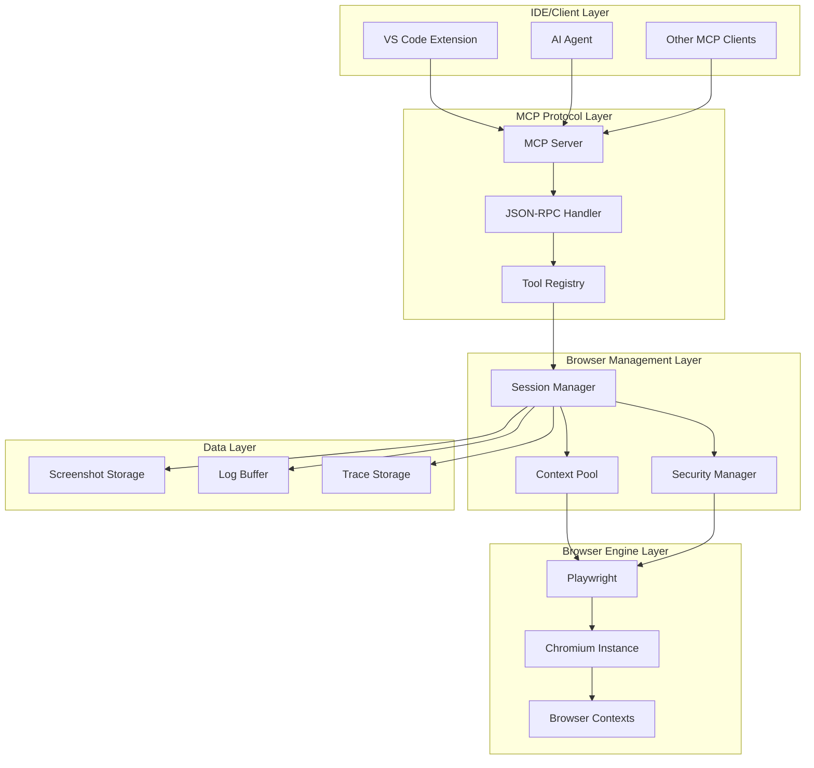

# Design Document

## Overview

The AI Browser via MCP + Chromium system is designed as a Node.js-based MCP server that exposes browser automation capabilities through standardized JSON-RPC tools. The architecture follows a layered approach with clear separation between the MCP protocol layer, browser management layer, and security/isolation layer.

The system uses Playwright as the browser automation engine due to its superior cross-browser support, built-in waiting mechanisms, and robust API. The MCP server will be implemented using the official MCP SDK for Node.js, ensuring compatibility with all MCP-compliant clients.

## Architecture



## Components and Interfaces

### MCP Server Core

**MCPBrowserServer**
- Extends the base MCP server class
- Manages tool registration and client connections
- Handles JSON-RPC message routing
- Implements health checking and graceful shutdown

```typescript
interface MCPBrowserServer {
  start(port: number): Promise<void>
  stop(): Promise<void>
  registerTool(tool: BrowserTool): void
  handleRequest(request: JSONRPCRequest): Promise<JSONRPCResponse>
}
```

### Browser Management

**SessionManager**
- Creates and manages isolated browser sessions
- Implements session lifecycle (create, use, cleanup)
- Enforces resource limits and timeouts
- Handles concurrent session requests

```typescript
interface SessionManager {
  createSession(options: SessionOptions): Promise<BrowserSession>
  getSession(sessionId: string): BrowserSession | null
  destroySession(sessionId: string): Promise<void>
  cleanupIdleSessions(): Promise<void>
}
```

**BrowserSession**
- Wraps a Playwright browser context
- Maintains session state and metadata
- Implements security policies per session
- Tracks resource usage and activity

```typescript
interface BrowserSession {
  id: string
  context: BrowserContext
  page: Page
  createdAt: Date
  lastActivity: Date
  allowedDomains: Set<string>
  networkLogs: NetworkLog[]
  consoleLogs: ConsoleLog[]
}
```

### Security Layer

**SecurityManager**
- Validates domain access against allowlists
- Filters sensitive data from network logs
- Implements rate limiting per client
- Manages user permission requests

```typescript
interface SecurityManager {
  checkDomainAccess(domain: string, sessionId: string): Promise<boolean>
  filterSensitiveData(data: any): any
  checkRateLimit(clientId: string, operation: string): boolean
  requestUserPermission(domain: string): Promise<boolean>
}
```

### Tool Implementations

Each browser tool is implemented as a separate class following the MCP tool interface:

**NavigationTool** (browser.goto)
- Handles URL navigation with wait conditions
- Implements timeout and error handling
- Validates URLs against security policies

**InteractionTools** (browser.click, browser.type, browser.select)
- Implements DOM element interaction
- Uses Playwright's built-in waiting mechanisms
- Provides detailed error messages for failed interactions

**CaptureTools** (browser.screenshot, browser.domSnapshot)
- Handles various screenshot formats and options
- Implements DOM serialization with node limits
- Manages temporary file storage for large captures

**MonitoringTools** (browser.network.getRecent, browser.console.getRecent)
- Maintains circular buffers for logs
- Implements filtering and pagination
- Provides real-time log streaming capabilities

## Data Models

### Session Configuration

```typescript
interface SessionOptions {
  viewport?: { width: number; height: number }
  userAgent?: string
  allowedDomains?: string[]
  timeout?: number
  headless?: boolean
}
```

### Network Log Entry

```typescript
interface NetworkLog {
  timestamp: Date
  method: string
  url: string
  status: number
  requestHeaders: Record<string, string>
  responseHeaders: Record<string, string>
  requestBody?: string
  responseBody?: string
  duration: number
}
```

### Console Log Entry

```typescript
interface ConsoleLog {
  timestamp: Date
  level: 'info' | 'warn' | 'error' | 'debug'
  message: string
  location?: {
    url: string
    lineNumber: number
    columnNumber: number
  }
}
```

### Screenshot Result

```typescript
interface ScreenshotResult {
  data: Buffer
  format: 'png' | 'jpeg'
  width: number
  height: number
  timestamp: Date
}
```

## Error Handling

### Error Categories

1. **Protocol Errors**: Invalid JSON-RPC requests, malformed parameters
2. **Security Errors**: Domain access denied, rate limit exceeded
3. **Browser Errors**: Navigation failures, element not found, timeout
4. **System Errors**: Resource exhaustion, browser crash, network issues

### Error Response Format

```typescript
interface ErrorResponse {
  code: number
  message: string
  data?: {
    category: 'protocol' | 'security' | 'browser' | 'system'
    details: any
    timestamp: Date
  }
}
```

### Recovery Strategies

- **Browser Context Recovery**: Automatically recreate crashed contexts
- **Session Isolation**: Prevent errors in one session from affecting others
- **Graceful Degradation**: Continue operation with reduced functionality when possible
- **Circuit Breaker**: Temporarily disable problematic operations

## Testing Strategy

### Unit Testing

- **Tool Implementation Tests**: Verify each MCP tool works correctly in isolation
- **Security Manager Tests**: Validate domain filtering and rate limiting
- **Session Manager Tests**: Test session lifecycle and resource management
- **Data Model Tests**: Verify serialization and validation logic

### Integration Testing

- **MCP Protocol Tests**: Verify JSON-RPC communication with mock clients
- **Browser Automation Tests**: Test Playwright integration with real browser
- **Security Integration Tests**: Validate end-to-end security policies
- **Performance Tests**: Measure response times and resource usage

### End-to-End Testing

- **IDE Integration Tests**: Test VS Code extension communication
- **Multi-Session Tests**: Verify concurrent session handling
- **Error Scenario Tests**: Test recovery from various failure modes
- **Security Penetration Tests**: Validate security boundaries

### Test Environment Setup

```typescript
// Test configuration
const testConfig = {
  browser: {
    headless: true,
    slowMo: 0,
    timeout: 5000
  },
  mcp: {
    port: 0, // Random available port
    logLevel: 'error'
  },
  security: {
    allowedDomains: ['localhost', 'example.com'],
    rateLimit: { requests: 100, window: 60000 }
  }
}
```

### Mock Implementations

- **MockBrowser**: Simulates browser behavior for unit tests
- **MockMCPClient**: Simulates MCP client requests
- **MockSecurityManager**: Provides predictable security responses
- **TestPageServer**: Serves test HTML pages for automation testing

## Performance Considerations

### Resource Management

- **Browser Context Pooling**: Reuse contexts when possible to reduce startup overhead
- **Memory Monitoring**: Track and limit memory usage per session
- **CPU Throttling**: Implement CPU usage limits for JavaScript execution
- **Disk Space Management**: Clean up temporary files and old screenshots

### Optimization Strategies

- **Lazy Loading**: Initialize browser instances only when needed
- **Connection Pooling**: Reuse network connections for better performance
- **Caching**: Cache DOM snapshots and screenshots when appropriate
- **Compression**: Compress large responses to reduce network overhead

### Scalability Limits

- **Maximum Concurrent Sessions**: 10 sessions per server instance
- **Session Timeout**: 30 minutes of inactivity
- **Request Rate Limit**: 60 requests per minute per client
- **Memory Limit**: 2GB total memory usage across all sessions

## Security Implementation

### Domain Allowlist Management

```typescript
class DomainManager {
  private allowedDomains: Set<string> = new Set()
  private pendingPermissions: Map<string, Promise<boolean>> = new Map()
  
  async checkAccess(domain: string): Promise<boolean> {
    if (this.allowedDomains.has(domain)) return true
    
    // Request user permission for new domains
    const permission = await this.requestPermission(domain)
    if (permission) {
      this.allowedDomains.add(domain)
    }
    return permission
  }
}
```

### Data Sanitization

```typescript
class DataSanitizer {
  private sensitiveHeaders = ['authorization', 'cookie', 'x-api-key']
  
  sanitizeNetworkLog(log: NetworkLog): NetworkLog {
    return {
      ...log,
      requestHeaders: this.filterHeaders(log.requestHeaders),
      responseHeaders: this.filterHeaders(log.responseHeaders),
      requestBody: this.sanitizeBody(log.requestBody),
      responseBody: this.sanitizeBody(log.responseBody)
    }
  }
  
  private filterHeaders(headers: Record<string, string>): Record<string, string> {
    const filtered = { ...headers }
    this.sensitiveHeaders.forEach(header => {
      if (filtered[header]) {
        filtered[header] = '[REDACTED]'
      }
    })
    return filtered
  }
}
```

### Rate Limiting

```typescript
class RateLimiter {
  private limits: Map<string, { count: number; resetTime: number }> = new Map()
  
  checkLimit(clientId: string, operation: string): boolean {
    const key = `${clientId}:${operation}`
    const limit = this.limits.get(key)
    const now = Date.now()
    
    if (!limit || now > limit.resetTime) {
      this.limits.set(key, { count: 1, resetTime: now + 60000 })
      return true
    }
    
    if (limit.count >= 60) return false
    
    limit.count++
    return true
  }
}
```